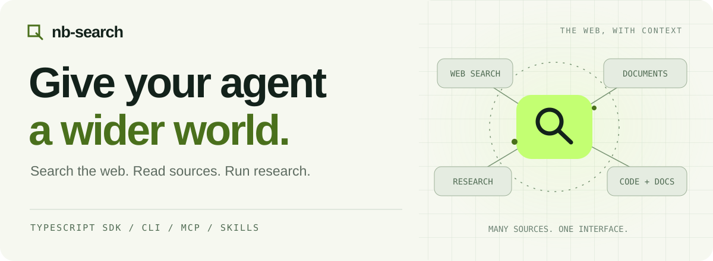
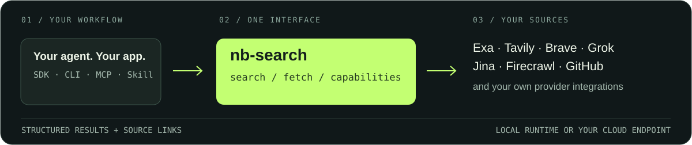

<div align="center">

<picture>
  <source media="(prefers-color-scheme: dark)" srcset="docs/assets/banner-dark.svg">
  
</picture>

**搜得到，读得懂，研究得更深。一个接口，接入你的 AI。**

[](https://nodejs.org/)
[](LICENSE)
[](https://nb-corp.github.io/nb-search/)

[快速开始](#快速开始) · [完整文档](https://nb-corp.github.io/nb-search/) · [数据源目录](https://nb-corp.github.io/nb-search/sources/) · [Agent Skill](SKILL.md)

[English](README.md) · **简体中文**

</div>

不用再为每个数据源接一套工具。**nb-search** 把网页搜索、网页阅读和研究能力放进同一个 TypeScript 接口，数据源由你选择。

嵌入应用、在终端调用、连接 MCP，或直接交给 AI 助手使用。你可以在本地运行，也可以通过相同的客户端接口连接自己的 [nb-search-cloud](https://github.com/NB-Corp/nb-search-cloud) 服务。

<p align="center"></p>

## 为什么用 nb-search？

- **让 AI 不止会查一个来源。** Exa、Tavily、Brave、Grok、Jina、Firecrawl、GitHub 等来源，可组合检索结果，也可选择专门的研究能力。[查看支持的来源 →](https://nb-corp.github.io/nb-search/sources/)
- **多个主题，一起研究。** 独立问题并行发起；耗时研究交给异步任务，状态可查、任务可取消、结果可完整取回。
- **拿到能直接用的数据。** 带来源链接的搜索结果、提取后的文档、结构化研究内容，而不是再解析一大段聊天文本。
- **接入工作流，不接管工作流。** SDK、CLI、MCP、Skill 共用运行时。复用本地来源配置，或连接远程 profile，不必在每个助手里重复配置每个来源。

## 快速开始

**需要 Node.js ≥ 24.15、pnpm 10.33.0。** 当前 CLI 请从源码获取；npm 的 `latest` 仍是较早版本。

```bash
git clone https://github.com/NB-Corp/nb-search.git
cd nb-search
pnpm install --frozen-lockfile
pnpm build
node scripts/nb-search.mjs fetch "https://nodejs.org/en/about/releases/" --pipeline direct.fetch
```

命令返回 JSON，正文位于 `documents[].content`，`status` 表示提取状态。这个直接抓取示例不需要服务商密钥。

需要搜索时，配置对应来源的密钥，再选择 lane：

```bash
# 在环境中配置 NB_SEARCH_EXA_API_KEY。
node scripts/nb-search.mjs search "Node.js release schedule" --lane exa.search
```

*Lane* 就是一个命名的来源操作，例如 `exa.search` 或 `gma.research`。可以每次指定，也可以[设为默认来源](https://nb-corp.github.io/nb-search/guide/configuration)。服务商的费用与限额按其自身规则计算。

## 三个方法，接入你的应用

```js
import { createNbSearchRuntime } from '@nb-corp/nb-search';

const search = createNbSearchRuntime();
const page = await search.fetch({
  action: 'run',
  source: {
    kind: 'url',
    url: 'https://nodejs.org/en/about/releases/'
  },
  pipeline: 'direct.fetch'
});

if (page.action === 'run' && page.execution === 'sync' && page.status === 'succeeded' && page.documents.length > 0) {
  console.log(page.documents[0].content);
}
```

这段代码读取公共网页，需要联网但不需要服务商密钥。用 `search.search()` 检索，用 `search.capabilities()` 查看可用能力。[SDK 示例、MCP 与远程连接 →](https://nb-corp.github.io/nb-search/guide/integrations)

TypeScript 项目使用当前打包声明时，应启用 `skipLibCheck: true`。[查看兼容性说明 →](https://nb-corp.github.io/nb-search/guide/integrations)

## 选一个入口，开始用

| 你想做什么 | 从这里开始 |
| --- | --- |
| 给 AI 助手接入搜索与研究 | [官方 nb-search Skill](SKILL.md) |
| 把网页或文件转换为 Markdown | [nb-extract](https://github.com/NB-Corp/nb-extract)：网页/文件→Markdown 文档转换入口 |
| 在应用或 MCP 宿主中集成 | [接入指南](https://nb-corp.github.io/nb-search/guide/integrations) |
| 团队统一管理来源凭证与调用 | [nb-search-cloud](https://github.com/NB-Corp/nb-search-cloud)：自托管用户、密钥与用量管理 |

## 详细用法交给 Wiki

[配置与凭证](https://nb-corp.github.io/nb-search/guide/configuration) · [正文提取](https://nb-corp.github.io/nb-search/guide/fetch) · [异步任务](https://nb-corp.github.io/nb-search/guide/jobs) · [故障排查](https://nb-corp.github.io/nb-search/guide/troubleshooting) · [升级指南](https://nb-corp.github.io/nb-search/guide/upgrading)

发现来源失效、接入问题，或者有更好的示例？欢迎[提交 Issue](https://github.com/NB-Corp/nb-search/issues) 或一个聚焦改进的 PR。报告中不要包含凭证。

[MIT](LICENSE) · [NB-Corp](https://github.com/NB-Corp)
